# Архитектура проекта
## AIOps Dashboard - Система мониторинга и прогнозирования нагрузки серверов

Документация описывает архитектуру системы, компоненты, потоки данных и структуру развертывания приложения для мониторинга и прогнозирования метрик серверов.

**Последнее обновление:** 2026-01-19  
**Версия:** 3.0

---

## Содержание

1. [Обзор системы](#обзор-системы)
2. [Высокоуровневая архитектура](#высокоуровневая-архитектура)
3. [Архитектура компонентов](#архитектура-компонентов)
4. [Диаграммы потоков данных](#диаграммы-потоков-данных)
5. [Схема базы данных](#схема-базы-данных)
6. [Архитектура развертывания](#архитектура-развертывания)
7. [Технологический стек](#технологический-стек)
8. [Архитектура тестирования](#архитектура-тестирования)
9. [Обработка ошибок](#обработка-ошибок)
10. [Модуль прогнозирования](#модуль-прогнозирования)

---

## Обзор системы

AIOps Dashboard - полнофункциональное приложение для мониторинга и прогнозирования метрик серверов с использованием машинного обучения.

### Основные компоненты

- **Backend API**: REST API на базе FastAPI с обработкой ошибок и валидацией
- **Frontend UI**: Интерактивный дашборд на Streamlit с прямым доступом к БД
- **База данных**: PostgreSQL для хранения временных рядов метрик
- **Forecasting Engine**: Модуль прогнозирования на базе Prophet
- **Testing Suite**: Комплексное тестовое покрытие на pytest
- **ETL Pipeline**: Инструменты для загрузки и подготовки данных
- **Reverse Proxy**: Apache HTTPd для маршрутизации и SSL

---

## Высокоуровневая архитектура

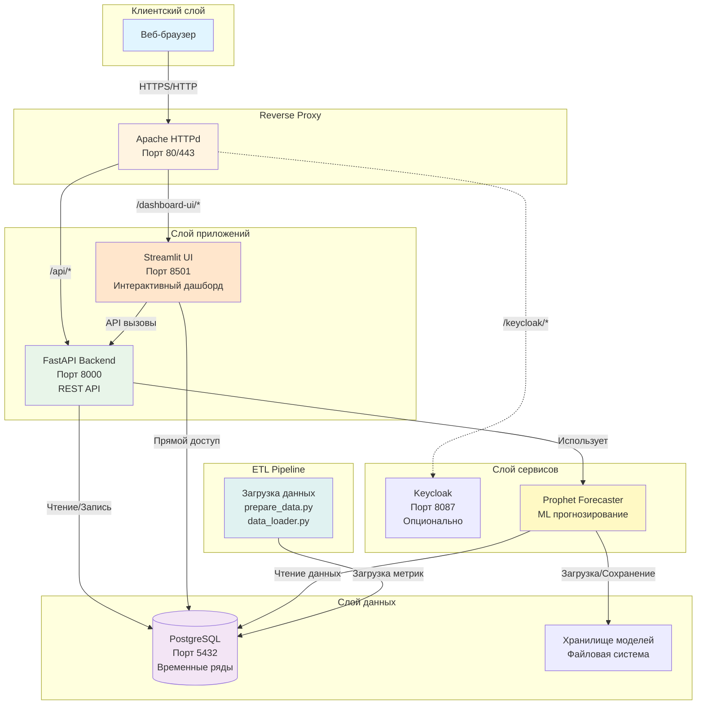

---

## Архитектура компонентов

### Backend API (FastAPI)

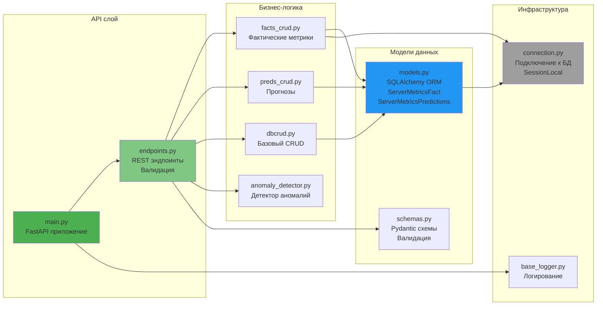

### Frontend UI (Streamlit)

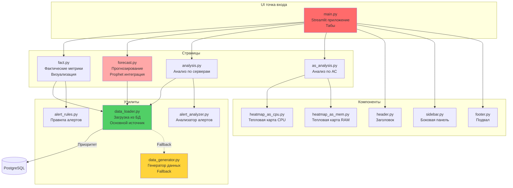

### Модуль прогнозирования (Prophet)

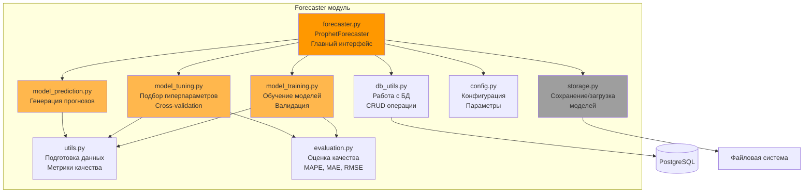

---

## Диаграммы потоков данных

### Загрузка метрик (Fact Metrics)

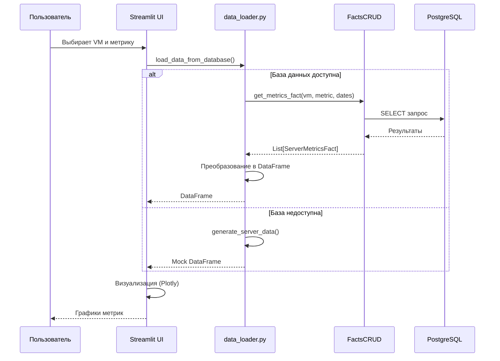

### Генерация прогноза

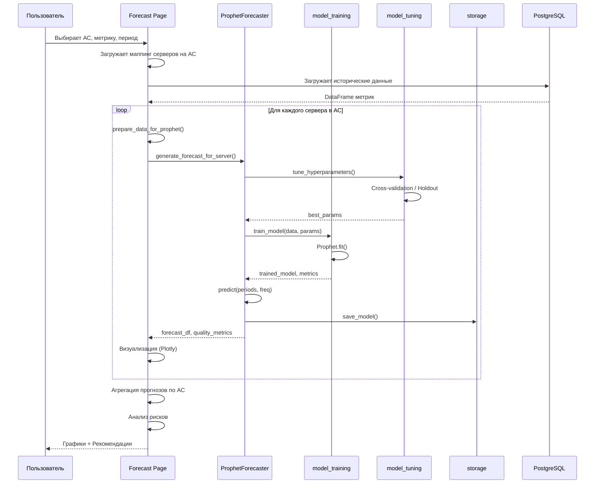

### ETL Pipeline

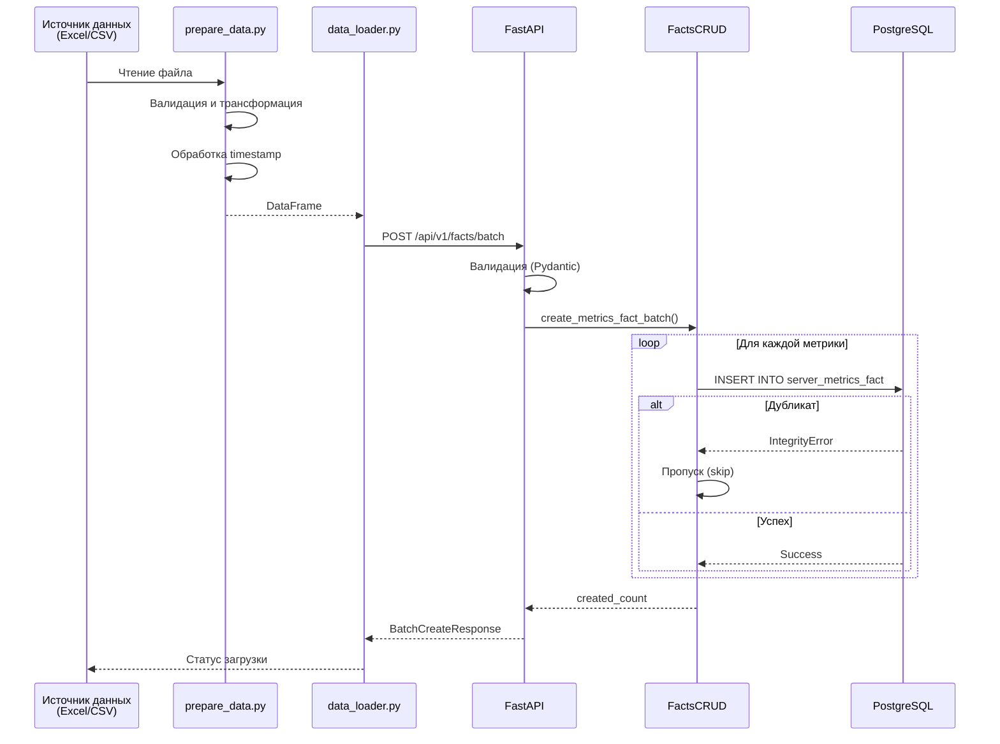

---

## Схема базы данных

### ER-диаграмма

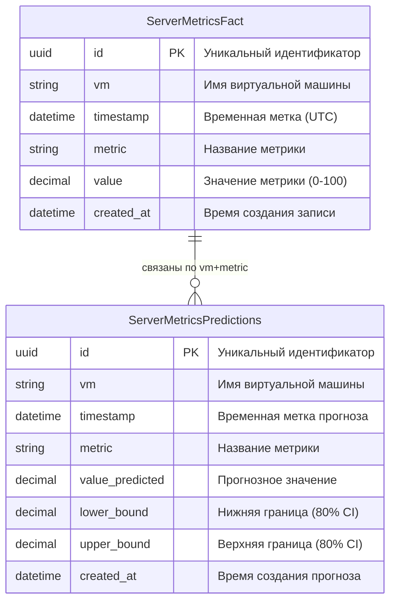

### Таблицы и индексы

#### server_metrics_fact

**Назначение**: Хранение фактических метрик серверов (CPU, RAM, Disk, Network)

**Структура**:
- `id` (UUID) - первичный ключ
- `vm` (VARCHAR 255) - имя виртуальной машины, индексировано
- `timestamp` (TIMESTAMP WITH TIMEZONE) - временная метка, индексировано
- `metric` (VARCHAR 255) - название метрики (cpu.usage.average, mem.usage.average)
- `value` (DECIMAL 20,5) - значение метрики, индексировано
- `created_at` (TIMESTAMP WITH TIMEZONE) - время создания записи

**Ограничения**:
- `UNIQUE (vm, timestamp, metric)` - уникальная комбинация
- `CHECK (timestamp <= CURRENT_TIMESTAMP)` - метка не из будущего
- Составной индекс: `idx_vm_timestamp_metric (vm, timestamp, metric)`

#### server_metrics_predictions

**Назначение**: Хранение прогнозов метрик

**Структура**:
- `id` (UUID) - первичный ключ
- `vm` (VARCHAR 255) - имя виртуальной машины, индексировано
- `timestamp` (TIMESTAMP WITH TIMEZONE) - временная метка прогноза, индексировано
- `metric` (VARCHAR 255) - название метрики
- `value_predicted` (DECIMAL 20,5) - прогнозное значение
- `lower_bound` (DECIMAL 20,5) - нижняя граница доверительного интервала
- `upper_bound` (DECIMAL 20,5) - верхняя граница доверительного интервала
- `created_at` (TIMESTAMP WITH TIMEZONE) - время создания прогноза

**Ограничения**:
- `UNIQUE (vm, timestamp, metric)` - уникальная комбинация прогноза
- Составной индекс: `idx_vm_timestamp_metric_pred (vm, timestamp, metric)`

---

## Архитектура развертывания

### Docker Compose конфигурация

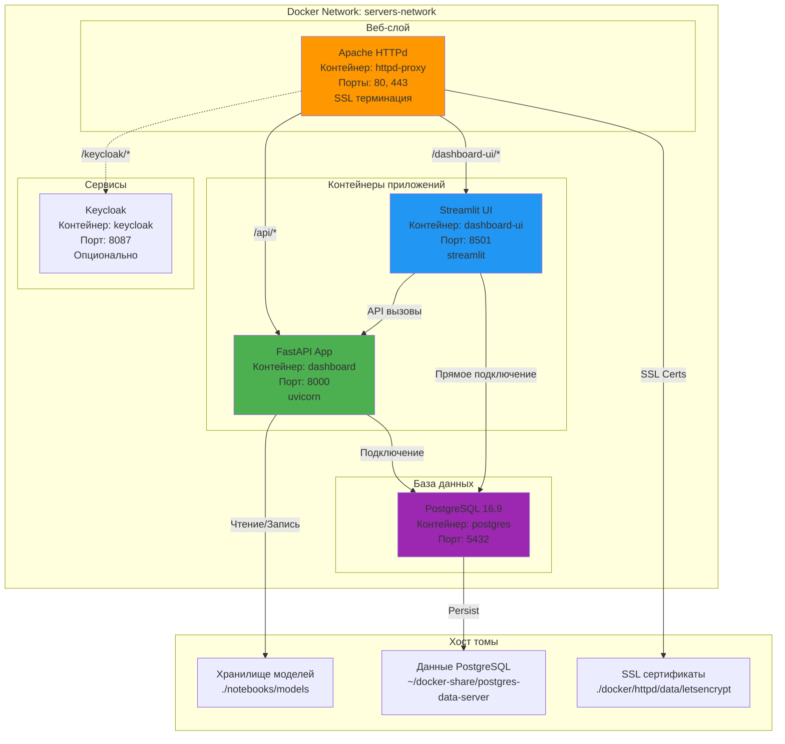

### Переменные окружения

#### Backend API (.env)
```env
DB_HOST=postgres
DB_PORT=5432
DB_USER=postgres
DB_PASSWORD=secure_password
DB_NAME=server_metrics

# Опционально
LOG_LEVEL=INFO
CORS_ORIGINS=*
```

#### Frontend UI (.env)
```env
# Подключение к БД (прямое)
DB_HOST=postgres
DB_PORT=5432
DB_USER=postgres
DB_PASSWORD=secure_password
DB_NAME=server_metrics

# API Backend (для некоторых операций)
API_URL=http://dashboard:8000

# Keycloak (опционально)
KEYCLOAK_URL=http://keycloak:8087/keycloak
KEYCLOAK_REALM=srv
KEYCLOAK_CLIENT_ID=srv-keycloak-client
KEYCLOAK_CLIENT_SECRET=change-me
```

---

## Технологический стек

### Backend

| Компонент | Технология | Версия | Назначение |
|-----------|-----------|--------|------------|
| Framework | FastAPI | 0.104.1 | REST API, асинхронная обработка |
| ORM | SQLAlchemy | 2.0.23 | Работа с PostgreSQL |
| Валидация | Pydantic | 2.5.0 | Схемы данных, валидация |
| ASGI Server | Uvicorn | 0.24.0 | Запуск FastAPI приложения |
| База данных | PostgreSQL | 16.9 | Хранение временных рядов |

### Frontend

| Компонент | Технология | Версия | Назначение |
|-----------|-----------|--------|------------|
| Framework | Streamlit | 1.29.0 | Интерактивный дашборд |
| Визуализация | Plotly | 5.18.0 | Графики и диаграммы |
| Данные | Pandas | 2.1.4 | Обработка DataFrame |
| Вычисления | NumPy | 1.26.2 | Численные операции |

### Machine Learning

| Компонент | Технология | Версия | Назначение |
|-----------|-----------|--------|------------|
| Прогнозирование | Prophet | 1.1.5 | Временные ряды, тренды, сезонность |
| Оптимизация | scikit-learn | - | Метрики качества (MAPE, MAE, RMSE) |

### Testing

| Компонент | Технология | Версия | Назначение |
|-----------|-----------|--------|------------|
| Test Framework | Pytest | 7.4.3 | Unit и интеграционные тесты |
| Coverage | pytest-cov | - | Покрытие кода тестами |
| HTTP Client | httpx | - | Тестирование API |
| Test DB | SQLite | - | In-memory база для тестов |

### Infrastructure

| Компонент | Технология | Назначение |
|-----------|-----------|------------|
| Containerization | Docker + Docker Compose | Контейнеризация сервисов |
| Reverse Proxy | Apache HTTPd 2.4 | Маршрутизация, SSL |
| Auth (опционально) | Keycloak 26.4.6 | SSO, управление доступом |

---

## Архитектура тестирования

### Структура тестов

```
tests/
├── __init__.py
├── conftest.py              # Фикстуры pytest
├── test_dbcrud.py          # Unit-тесты DBCRUD
├── test_factscrud.py       # Unit-тесты FactsCRUD
├── test_predscrud.py       # Unit-тесты PredsCRUD
├── test_api_endpoints.py   # Интеграционные тесты API
├── test_anomaly_detector.py
├── test_prophet_forecaster_prepare.py
├── test_ui_alert_analyzer.py
├── test_ui_alert_rules.py
├── test_ui_data_loader.py
├── test_utils_prepare_data.py
├── requirements.txt
└── README.md
```

### Покрытие тестами

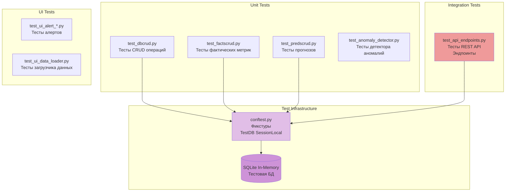

### Запуск тестов

```bash
# Все тесты
pytest

# С покрытием
pytest --cov=src/app --cov-report=html

# Конкретный файл
pytest tests/test_api_endpoints.py

# Verbose режим
pytest -v

# Windows
run_tests.bat
```

---

## Обработка ошибок

### Уровни обработки

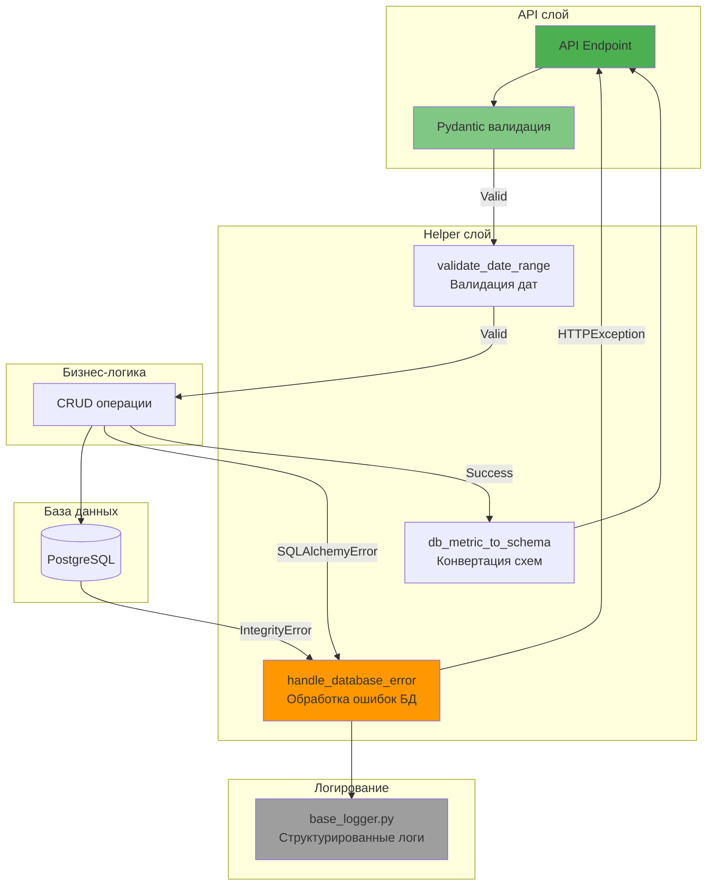

### Типы ошибок

| HTTP Code | Тип ошибки | Причина | Обработка |
|-----------|-----------|---------|-----------|
| 400 | Bad Request | Невалидные параметры, пустые значения | Pydantic валидация |
| 404 | Not Found | VM/метрика не найдена | CRUD слой |
| 409 | Conflict | Дубликаты, нарушение уникальности | IntegrityError обработка |
| 500 | Internal Server Error | Ошибки БД, непредвиденные исключения | handle_database_error() |

### Константы и лимиты

```python
# Из endpoints.py
DEFAULT_LIMIT = 5000          # Лимит по умолчанию
MAX_LIMIT = 10000             # Максимальный лимит
DEFAULT_HOURS = 24            # Часы по умолчанию
MAX_HOURS = 720               # Макс часы (30 дней)
DEFAULT_DAYS_TO_KEEP = 90     # Хранение данных
MAX_DAYS_TO_KEEP = 365        # Максимальное хранение
MIN_INTERVAL_MINUTES = 1      # Минимальный интервал
MAX_INTERVAL_MINUTES = 1440   # Макс интервал (24 часа)
DEFAULT_INTERVAL_MINUTES = 30 # Интервал по умолчанию
```

---

## Модуль прогнозирования

### Архитектура ProphetForecaster

#### Основные возможности

1. **Обучение моделей** с кросс-валидацией
2. **Подбор гиперпараметров** (Grid Search с параллелизацией)
3. **Временные признаки**: час, день недели, месяц, квартал, выходные и т.д.
4. **Оценка качества**: MAPE, MAE, RMSE
5. **Сохранение/загрузка** обученных моделей
6. **Генерация прогнозов** с доверительными интервалами

#### Гиперпараметры для подбора

```python
# Из forecast.py
param_grid = {
    'seasonality_mode': ['additive', 'multiplicative'],
    'changepoint_prior_scale': [0.01, 0.05, 0.1, 0.2],
    'seasonality_prior_scale': [3.0, 5.0, 10.0, 15.0],
    'holidays_prior_scale': [5.0, 10.0],
    'changepoint_range': [0.8, 0.9, 0.95],
    'n_changepoints': [15, 25, 35],
    'daily_seasonality': True,
    'weekly_seasonality': True
}
```

#### Временные признаки (Регрессоры)

- `hour` - час дня (0-23)
- `day_of_week` - день недели (0-6)
- `day_of_month` - день месяца (1-31)
- `week_of_year` - неделя года (1-52)
- `month` - месяц (1-12)
- `quarter` - квартал (1-4)
- `is_weekend` - выходной день (0/1)
- `is_month_start` - начало месяца (0/1)
- `is_month_end` - конец месяца (0/1)
- `is_quarter_start` - начало квартала (0/1)
- `is_quarter_end` - конец квартала (0/1)
- `is_year_start` - начало года (0/1)
- `is_year_end` - конец года (0/1)

#### Процесс прогнозирования

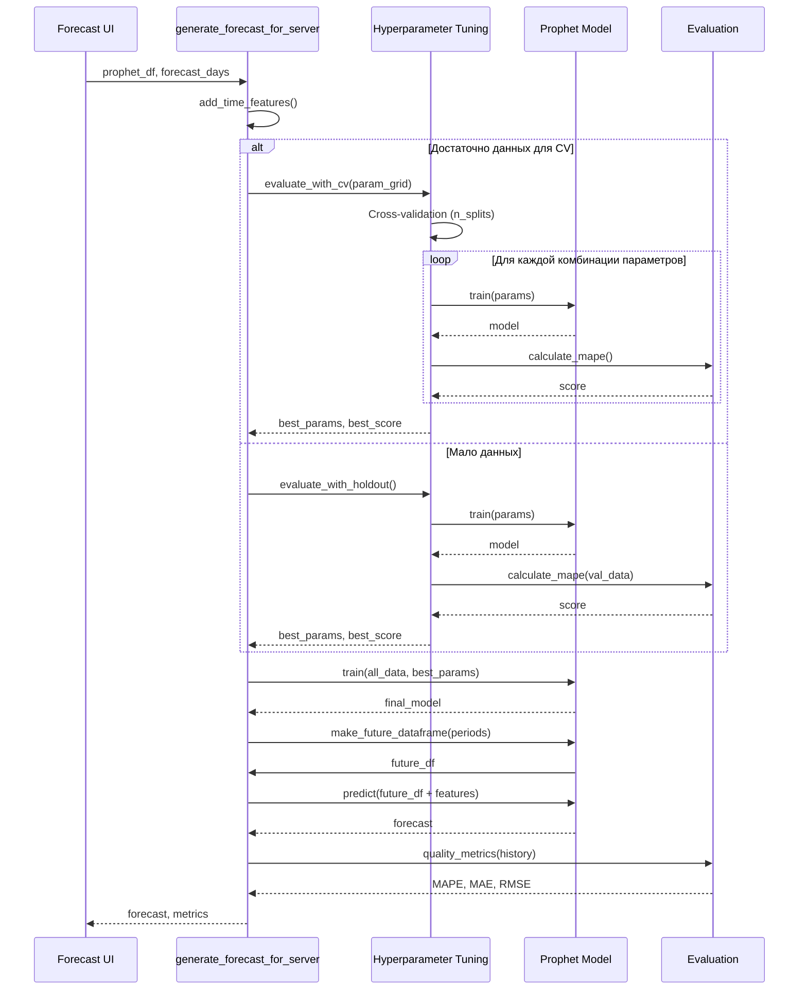

### Метрики качества

#### MAPE (Mean Absolute Percentage Error)

```python
MAPE = mean(|actual - predicted| / actual) × 100%
```

**Интерпретация**:
- MAPE < 10% - отличное качество (зеленый)
- MAPE 10-20% - хорошее качество (желтый)
- MAPE 20-30% - среднее качество (оранжевый)
- MAPE > 30% - низкое качество (красный)

#### MAE (Mean Absolute Error)

```python
MAE = mean(|actual - predicted|)
```

#### RMSE (Root Mean Squared Error)

```python
RMSE = sqrt(mean((actual - predicted)²))
```

### Анализ рисков

Автоматическая оценка уровня риска на основе прогнозной нагрузки:

| Уровень риска | Диапазон нагрузки | Рекомендации |
|--------------|-------------------|--------------|
| 🟩 Низкий | < 50% | Система стабильна, плановое обслуживание |
| 🟨 Средний | 50-70% | Мониторинг, подготовка к масштабированию |
| 🟧 Высокий | 70-85% | Планирование ресурсов, настройка алертов |
| 🟥 Критический | > 85% | Срочное масштабирование, балансировка нагрузки |

---

## API Endpoints

### Основные группы

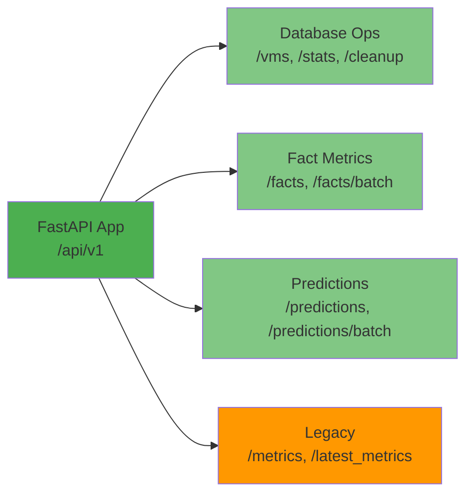

### Ключевые эндпоинты

| Метод | Путь | Назначение |
|-------|------|-----------|
| GET | `/api/v1/vms` | Список всех VM |
| GET | `/api/v1/vms/{vm}/metrics` | Метрики конкретной VM |
| GET | `/api/v1/facts` | Фактические метрики с фильтрами |
| POST | `/api/v1/facts/batch` | Массовая загрузка метрик |
| GET | `/api/v1/facts/latest` | Последние метрики |
| GET | `/api/v1/predictions` | Прогнозы с фильтрами |
| POST | `/api/v1/predictions/batch` | Массовая загрузка прогнозов |
| GET | `/api/v1/predictions/future` | Будущие прогнозы |
| GET | `/api/v1/predictions/compare` | Сравнение факт vs прогноз |
| GET | `/api/v1/stats` | Статистика БД |
| DELETE | `/api/v1/cleanup` | Очистка старых данных |

**Документация**: `http://localhost:8000/docs` (Swagger UI)

---

## Структура файлов проекта

```
servers-dashboard/
├── src/
│   ├── app/                          # FastAPI Backend
│   │   ├── main.py                   # Точка входа FastAPI
│   │   ├── endpoints.py              # REST API эндпоинты
│   │   ├── models.py                 # SQLAlchemy модели
│   │   ├── schemas.py                # Pydantic схемы
│   │   ├── connection.py             # Подключение к БД
│   │   ├── dbcrud.py                 # Базовый CRUD
│   │   ├── facts_crud.py             # CRUD фактических метрик
│   │   ├── preds_crud.py             # CRUD прогнозов
│   │   ├── anomaly_detector.py       # Детектор аномалий
│   │   ├── base_logger.py            # Логирование
│   │   └── requirements.txt
│   │
│   └── ui/                           # Streamlit Frontend
│       ├── main.py                   # Точка входа Streamlit
│       ├── pages/                    # Страницы дашборда
│       │   ├── fact.py               # Фактические метрики
│       │   ├── forecast.py           # Прогнозирование
│       │   ├── analysis.py           # Анализ по серверам
│       │   └── as_analysis.py        # Анализ по АС
│       ├── components/               # UI компоненты
│       │   ├── header.py
│       │   ├── sidebar.py
│       │   ├── footer.py
│       │   ├── heatmap_as_cpu.py
│       │   └── heatmap_as_mem.py
│       ├── utils/                    # Утилиты UI
│       │   ├── data_loader.py        # Загрузка данных из БД
│       │   ├── data_generator.py     # Генератор моков
│       │   ├── alert_rules.py        # Правила алертов
│       │   ├── alert_analyzer.py     # Анализатор алертов
│       │   └── base_logger.py
│       ├── assets/
│       │   └── style.css             # Стили
│       └── requirements.txt
│
├── notebooks/
│   └── forecast/                     # Модуль прогнозирования
│       ├── forecaster.py             # Главный интерфейс
│       ├── model_training.py         # Обучение моделей
│       ├── model_tuning.py           # Подбор гиперпараметров
│       ├── model_prediction.py       # Генерация прогнозов
│       ├── storage.py                # Сохранение/загрузка
│       ├── evaluation.py             # Оценка качества
│       ├── utils.py                  # Утилиты
│       ├── config.py                 # Конфигурация
│       └── db_utils.py               # Работа с БД
│
├── ETL/                              # ETL Pipeline
│   ├── prepare_data.py               # Подготовка данных
│   ├── data_loader.py                # Загрузчик данных
│   └── new_data.py
│
├── tests/                            # Тесты
│   ├── conftest.py                   # Фикстуры pytest
│   ├── test_dbcrud.py
│   ├── test_factscrud.py
│   ├── test_predscrud.py
│   ├── test_api_endpoints.py
│   ├── test_anomaly_detector.py
│   ├── test_prophet_forecaster_prepare.py
│   └── test_ui_*.py
│
├── docker/                           # Docker конфигурация
│   └── all/
│       └── docker-compose.yml        # Полный стек
│
├── data/                             # Данные
│   ├── source/                       # Исходные файлы
│   │   ├── all_vm.xlsx               # Маппинг серверов на АС
│   │   └── data.xlsx
│   ├── dbdata/                       # Данные для загрузки
│   ├── dbextract/                    # Экспорты из БД
│   └── graphics/                     # Сохраненные графики
│
├── docs/                             # Документация
│   ├── ARCHITECTURE.md               # Этот файл
│   ├── API_ENDPOINTS.md              # API документация
│   ├── TESTING.md                    # Тестирование
│   └── PROJECT_SUMMARY_RU.md         # Краткое описание
│
├── README.md                         # Главный README
├── requirements.txt                  # Общие зависимости
├── pytest.ini                        # Конфигурация pytest
├── pyproject.toml                    # Конфигурация проекта
└── LICENSE
```

---

## Рекомендации по улучшению

### Производительность

1. **Кэширование** - добавить Redis для кэширования запросов
2. **Асинхронность** - перейти на async SQLAlchemy
3. **Connection Pooling** - оптимизация пула подключений
4. **Read Replicas** - реплики БД для чтения
5. **API Gateway** - rate limiting, throttling

### Безопасность

1. **CORS** - ограничить origins в продакшене
2. **Аутентификация** - завершить интеграцию Keycloak
3. **Secrets Management** - использовать vault для секретов
4. **HTTPS** - включить SSL в production
5. **Input Sanitization** - дополнительная валидация входных данных

### Мониторинг

1. **Prometheus** - сбор метрик
2. **Grafana** - визуализация метрик
3. **ELK Stack** - централизованное логирование
4. **Distributed Tracing** - OpenTelemetry
5. **Health Checks** - эндпоинты health и readiness

### Scalability

1. **Horizontal Scaling** - масштабирование API и UI
2. **Load Balancer** - балансировка нагрузки
3. **Database Sharding** - шардирование БД по VM
4. **Object Storage** - S3/MinIO для моделей
5. **Message Queue** - RabbitMQ/Kafka для асинхронных задач

---

## Заключение

Архитектура AIOps Dashboard обеспечивает:

✅ **Модульность** - четкое разделение компонентов  
✅ **Масштабируемость** - готовность к горизонтальному масштабированию  
✅ **Надежность** - обработка ошибок, валидация, тестирование  
✅ **Производительность** - оптимизация запросов, индексы БД  
✅ **Удобство** - интерактивный UI, REST API, документация  
✅ **ML/AI** - прогнозирование с Prophet, подбор гиперпараметров  

### Ключевые преимущества

- Прямое подключение UI к БД для минимальной латентности
- Модуль прогнозирования с автоматическим подбором гиперпараметров
- Комплексная обработка ошибок и валидация данных
- Анализ по Автоматизированным Системам (АС)
- Docker-based развертывание для всех сред

---

**Версия документа**: 3.0  
**Дата**: 2026-01-19  
**Автор**: AIOps Dashboard Team
