# Architecture Documentation
## AIOps Dashboard Project

This document describes the system architecture, components, data flow, and deployment structure of the AIOps Dashboard application.

**Last Updated:** 2025-01-27  
**Version:** 2.0

---

## Table of Contents

1. [System Overview](#system-overview)
2. [High-Level Architecture](#high-level-architecture)
3. [Component Architecture](#component-architecture)
4. [Data Flow Diagrams](#data-flow-diagrams)
5. [Database Schema](#database-schema)
6. [Deployment Architecture](#deployment-architecture)
7. [Technology Stack](#technology-stack)
8. [Testing Architecture](#testing-architecture)
9. [Error Handling Architecture](#error-handling-architecture)

---

## System Overview

The AIOps Dashboard is a full-stack application for monitoring and forecasting server metrics. It consists of:

- **Backend API**: FastAPI-based REST API with comprehensive error handling and validation
- **Frontend UI**: Streamlit-based interactive dashboard with database integration
- **Database**: PostgreSQL for time-series metrics storage
- **Forecasting Engine**: Prophet-based time series forecasting
- **Testing Suite**: Comprehensive pytest-based test coverage
- **Authentication**: Keycloak integration (configured but not fully implemented)
- **Reverse Proxy**: Apache HTTPd for routing and SSL termination

---

## High-Level Architecture

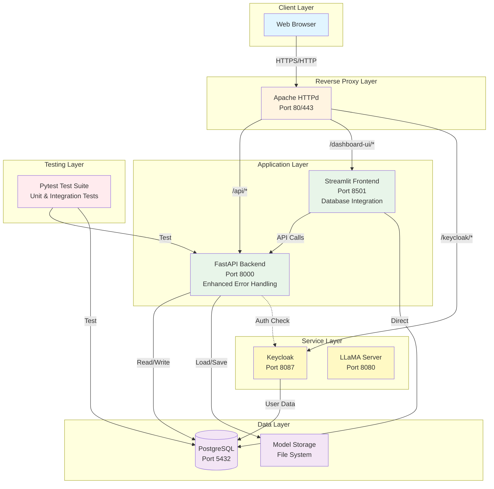

---

## Component Architecture

### Backend API Components

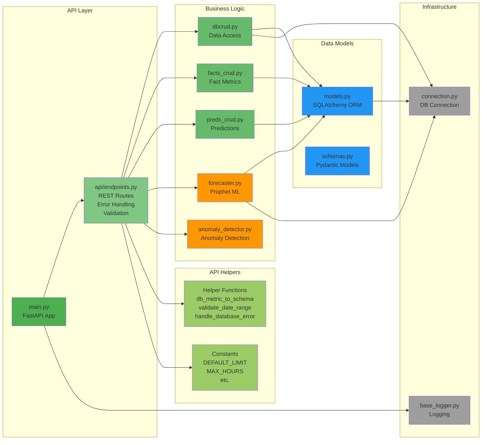

### Frontend UI Components

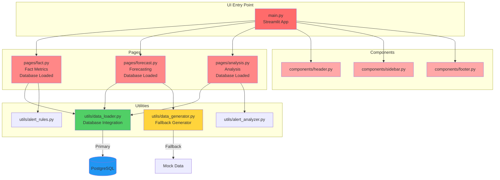

### Testing Architecture

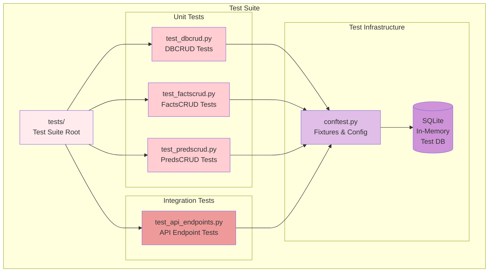

---

## Data Flow Diagrams

### Metrics Retrieval Flow (Enhanced)

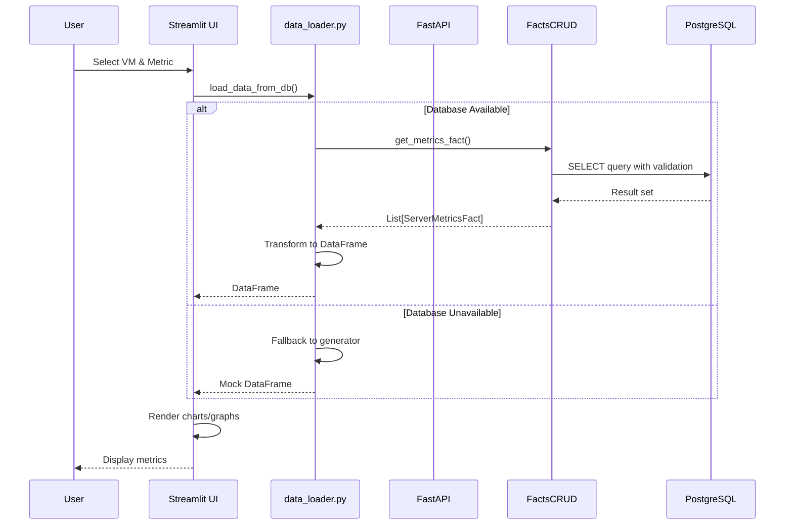

### API Request Flow with Error Handling

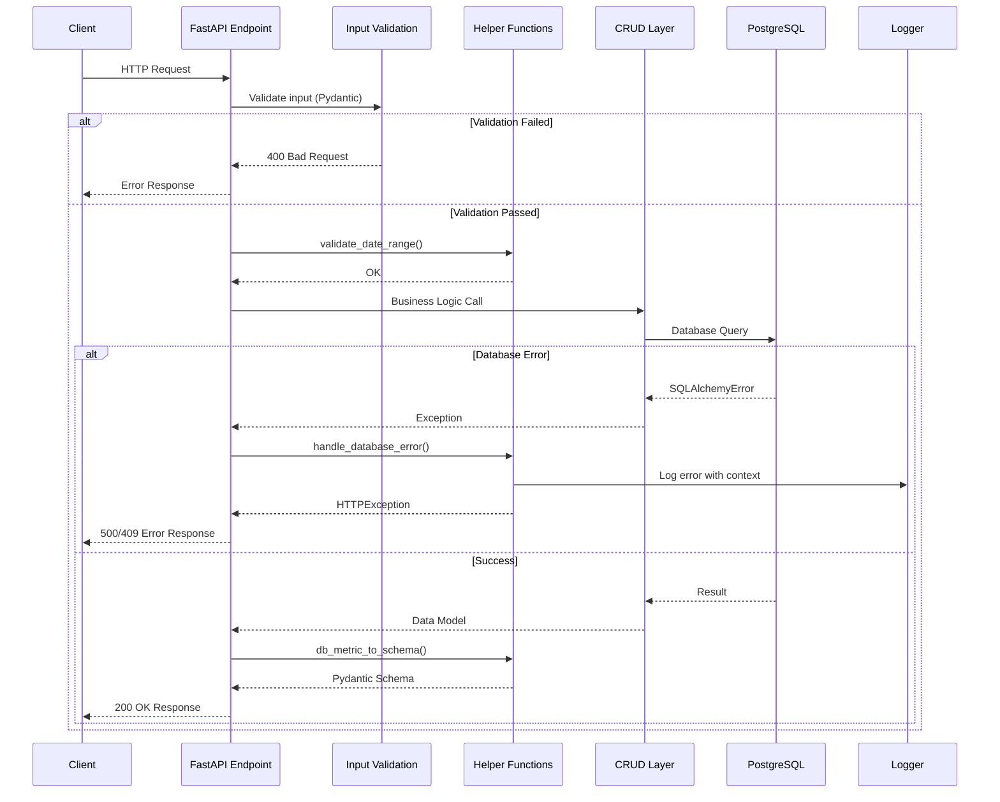

### Forecasting Flow

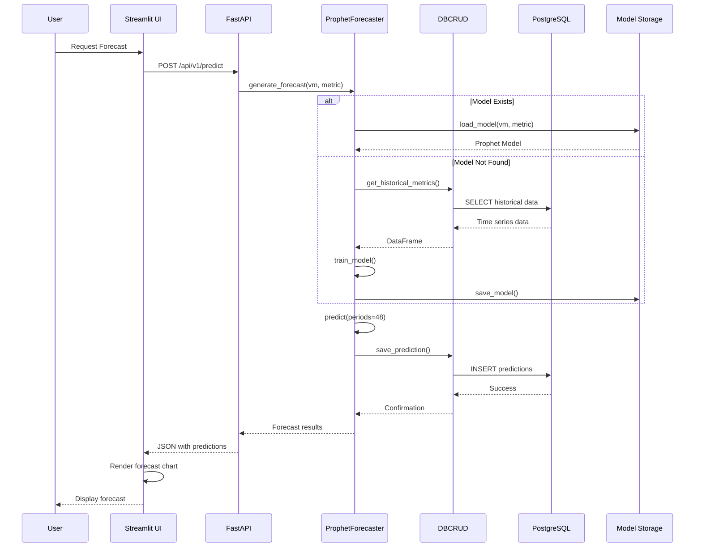

### Data Ingestion Flow

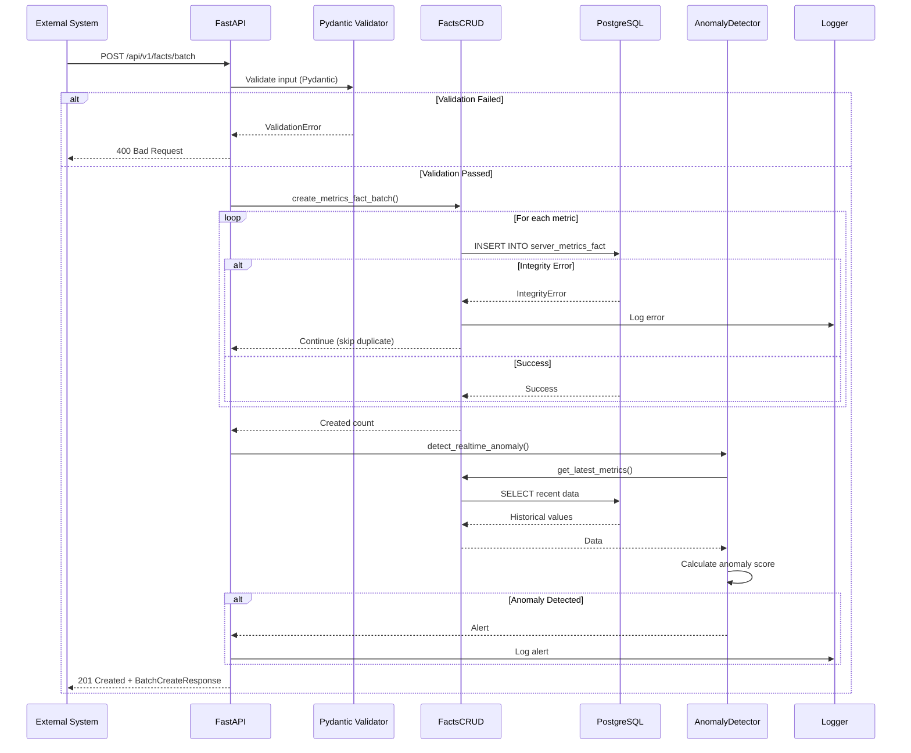

---

## Database Schema

### Entity Relationship Diagram

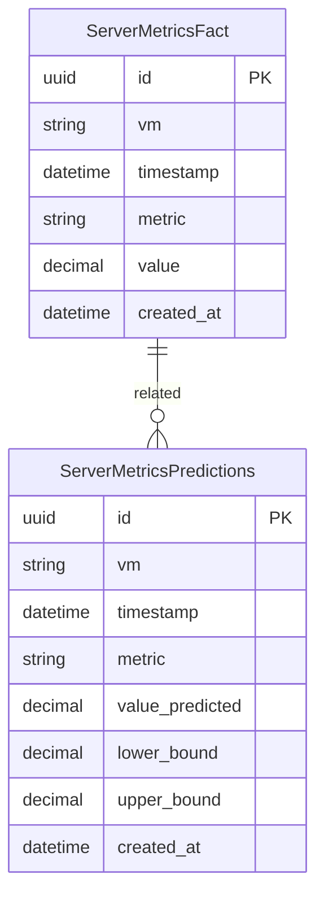

### Table Structure

#### server_metrics_fact
- **Purpose**: Stores actual/historical server metrics
- **Primary Key**: `id` (UUID)
- **Unique Constraint**: `(vm, timestamp, metric)`
- **Indexes**: 
  - `idx_vm_timestamp_metric` on `(vm, timestamp, metric)`
  - Individual indexes on `vm`, `timestamp`, `value`
- **Constraints**: 
  - `chk_timestamp_not_future`: Ensures timestamps are not in the future
  - `chk_value_range`: Ensures values are between 0 and 100

#### server_metrics_predictions
- **Purpose**: Stores forecasted/predicted metrics
- **Primary Key**: `id` (UUID)
- **Unique Constraint**: `(vm, timestamp, metric)`
- **Indexes**: 
  - `idx_vm_timestamp_metric_pred` on `(vm, timestamp, metric)`
  - Individual indexes on `vm`, `timestamp`
- **Fields**: Includes confidence intervals (`lower_bound`, `upper_bound`)

---

## Deployment Architecture

### Docker Compose Deployment

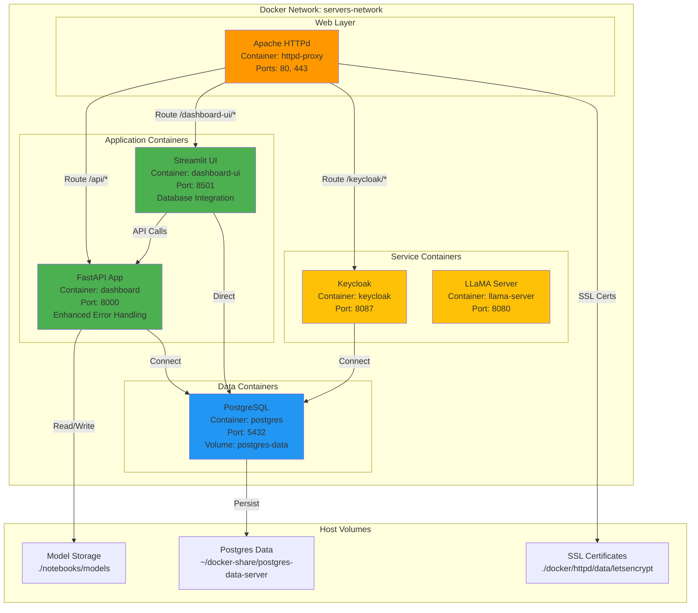

---

## Technology Stack

### Backend Stack
```
┌─────────────────────────────────────┐
│         FastAPI 0.104.1            │
│  - REST API Framework               │
│  - Async support                    │
│  - Auto-generated OpenAPI docs      │
│  - Enhanced error handling          │
│  - Input validation (Pydantic)      │
└─────────────────────────────────────┘
           │
           ├─── SQLAlchemy 2.0.23
           │    - ORM for PostgreSQL
           │    - Error handling (SQLAlchemyError)
           │
           ├─── Pydantic 2.5.0
           │    - Data validation
           │    - Type safety
           │
           ├─── Prophet 1.1.5
           │    - Time series forecasting
           │
           └─── Uvicorn 0.24.0
                - ASGI server
```

### Frontend Stack
```
┌─────────────────────────────────────┐
│      Streamlit 1.29.0               │
│  - Interactive dashboard             │
│  - Real-time updates                 │
│  - Database integration              │
│  - Data caching (@st.cache_data)     │
└─────────────────────────────────────┘
           │
           ├─── Plotly 5.18.0
           │    - Interactive charts
           │
           ├─── Pandas 2.1.4
           │    - Data manipulation
           │
           └─── NumPy 1.26.2
                - Numerical operations
```

### Testing Stack
```
┌─────────────────────────────────────┐
│         Pytest 7.4.3                │
│  - Unit testing                      │
│  - Integration testing               │
│  - Fixture management                │
└─────────────────────────────────────┘
           │
           ├─── pytest-cov
           │    - Coverage reporting
           │
           ├─── httpx
           │    - HTTP client for testing
           │
           └─── SQLite (in-memory)
                - Test database
```

### Infrastructure Stack
```
┌─────────────────────────────────────┐
│         Docker & Docker Compose     │
│  - Containerization                  │
│  - Multi-service orchestration       │
└─────────────────────────────────────┘
           │
           ├─── PostgreSQL 16.9
           │    - Time-series database
           │
           ├─── Apache HTTPd 2.4
           │    - Reverse proxy
           │    - SSL termination
           │
           ├─── Keycloak 26.4.6
           │    - Identity management
           │
           └─── LLaMA Server
                - AI/ML capabilities
```

---

## Testing Architecture

### Test Structure

```
tests/
├── __init__.py
├── conftest.py              # Pytest fixtures and configuration
├── test_dbcrud.py          # Unit tests for DBCRUD
├── test_factscrud.py       # Unit tests for FactsCRUD
├── test_predscrud.py       # Unit tests for PredsCRUD
├── test_api_endpoints.py   # Integration tests for API
├── requirements.txt        # Test dependencies
└── README.md               # Test documentation
```

### Test Coverage

- **Unit Tests**: Test individual CRUD operations in isolation
- **Integration Tests**: Test API endpoints with test database
- **Fixtures**: Reusable test data and database sessions
- **Test Database**: In-memory SQLite for fast, isolated tests

### Test Execution

```bash
# Run all tests
pytest

# Run with coverage
pytest --cov=src/app --cov-report=html

# Run specific test.csv file
pytest tests/test_api_endpoints.py

# Run with verbose output
pytest -v
```

---

## Error Handling Architecture

### Error Handling Layers

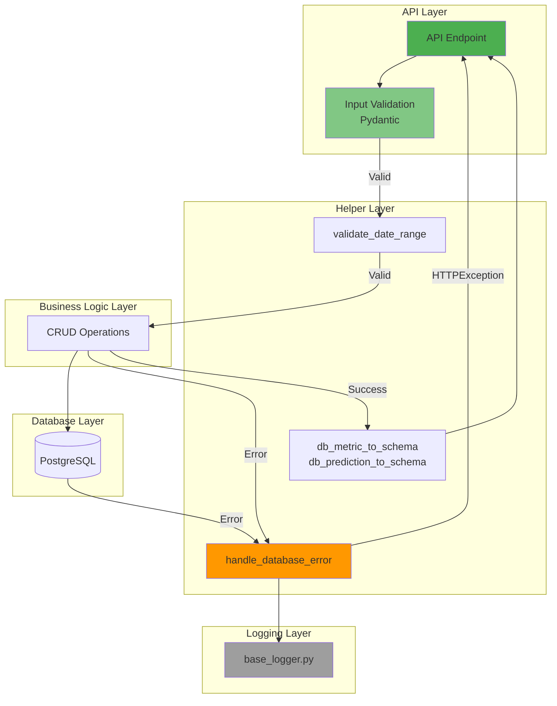

### Error Types and Handling

1. **Validation Errors (400 Bad Request)**
   - Empty VM/metric names
   - Invalid date ranges
   - Value out of range (0-100)
   - Missing required parameters

2. **Database Errors**
   - **IntegrityError (409 Conflict)**: Duplicate records, constraint violations
   - **SQLAlchemyError (500 Internal Server Error)**: Connection issues, query errors

3. **Not Found Errors (404)**
   - VM/metric not found
   - No data for time range

4. **Unexpected Errors (500)**
   - Caught with full stack trace logging
   - Generic error message to client

### Constants and Configuration

The API uses constants for limits and defaults:

```python
DEFAULT_LIMIT = 5000          # Default query limit
MAX_LIMIT = 10000             # Maximum query limit
DEFAULT_HOURS = 24            # Default hours for latest queries
MAX_HOURS = 720               # Maximum hours (30 days)
DEFAULT_DAYS_TO_KEEP = 90     # Default cleanup retention
MAX_DAYS_TO_KEEP = 365        # Maximum cleanup retention
MIN_INTERVAL_MINUTES = 1      # Minimum interval for completeness
MAX_INTERVAL_MINUTES = 1440   # Maximum interval (24 hours)
DEFAULT_INTERVAL_MINUTES = 30 # Default interval
```

---

## Module Dependencies

### Backend Dependencies Graph

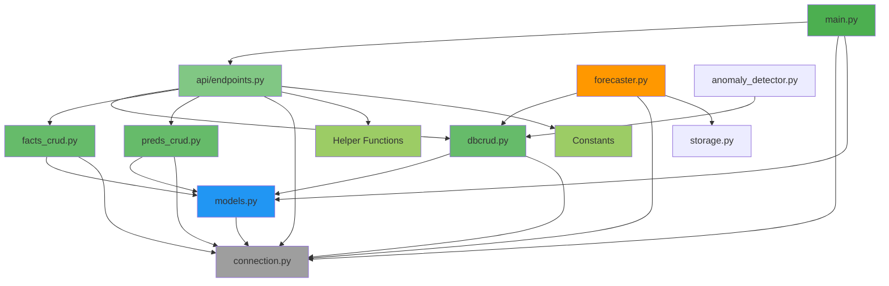

---

## API Endpoints Structure

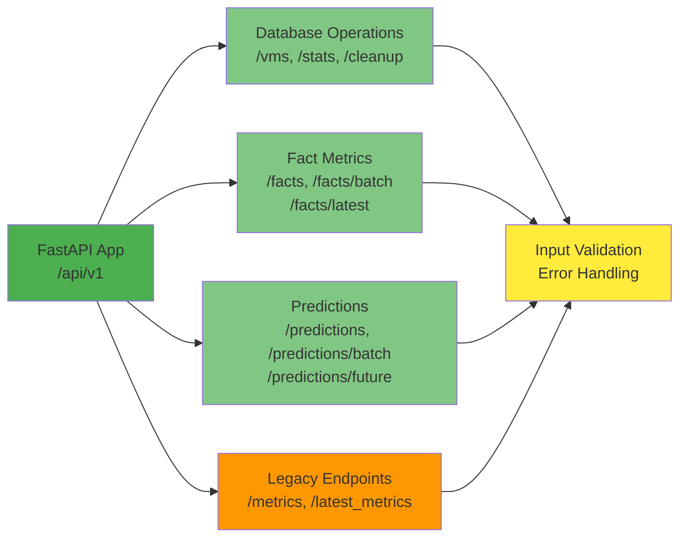

**Current Endpoints:**
- **Database Operations**: `/vms`, `/vms/{vm}/metrics`, `/stats`, `/cleanup`, `/completeness`, `/missing-data`
- **Fact Metrics**: `/facts`, `/facts/batch`, `/facts/latest`, `/facts/statistics`
- **Predictions**: `/predictions`, `/predictions/batch`, `/predictions/future`, `/predictions/compare`
- **Legacy**: `/metrics`, `/latest_metrics` (for backward compatibility)

---

## Data Processing Pipeline

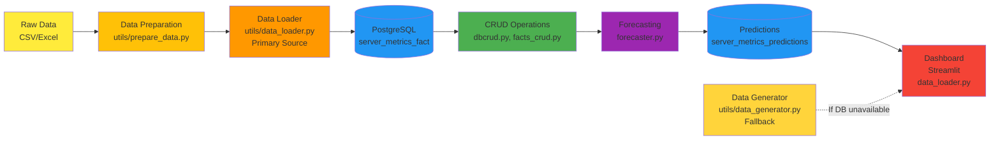

---

## Security Architecture (Planned)

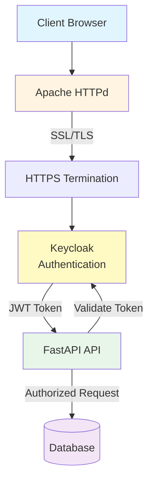

**Note:** Authentication is configured but not fully implemented in the current codebase.

---

## File Structure Overview

```
dashboard/
├── src/
│   ├── app/              # FastAPI Backend
│   │   ├── api/         # API endpoints
│   │   │   └── endpoints.py  # Enhanced with error handling
│   │   ├── models.py    # Database models
│   │   ├── schemas.py   # Pydantic schemas
│   │   ├── dbcrud.py    # Database operations
│   │   ├── facts_crud.py # Fact metrics CRUD
│   │   ├── preds_crud.py # Predictions CRUD
│   │   └── main.py      # FastAPI app
│   │
│   └── ui/              # Streamlit Frontend
│       ├── pages/       # Page components
│       │   ├── fact.py      # Database integrated
│       │   ├── forecast.py  # Database integrated
│       │   └── analysis.py  # Database integrated
│       ├── components/  # UI components
│       └── utils/       # UI utilities
│           ├── data_loader.py   # Primary data source
│           └── data_generator.py # Fallback generator
│
├── forecast/            # Forecasting module
│   ├── forecaster.py    # Main interface
│   ├── model_training.py
│   ├── model_tuning.py
│   └── ...
│
├── tests/               # Test suite
│   ├── conftest.py      # Test fixtures
│   ├── test_dbcrud.py   # Unit tests
│   ├── test_factscrud.py
│   ├── test_predscrud.py
│   ├── test_api_endpoints.py  # Integration tests
│   └── README.md
│
├── docker/              # Docker configurations
│   ├── app/            # API container
│   ├── ui/             # UI container
│   ├── postgres/       # Database container
│   └── httpd/          # Reverse proxy
│
├── notebooks/          # Jupyter notebooks
└── data/              # Data files
    ├── source/        # Raw data
    └── processed/     # Processed data
```

---

## Performance Considerations

### Current Architecture
- **Synchronous database operations** (SQLAlchemy ORM)
- **No caching layer** (Redis/Memcached)
- **Direct database queries** from UI (with fallback to generator)
- **File-based model storage** (could use object storage)
- **Streamlit caching** (`@st.cache_data`) for UI performance

### Recommended Improvements
1. **Add Redis** for caching frequently accessed data
2. **Implement async database operations** (async SQLAlchemy)
3. **Add API gateway** for rate limiting
4. **Use object storage** (S3/MinIO) for model files
5. **Implement connection pooling** optimization
6. **Add database read replicas** for scaling
7. **Implement response caching** for API endpoints

---

## Monitoring & Observability (Planned)

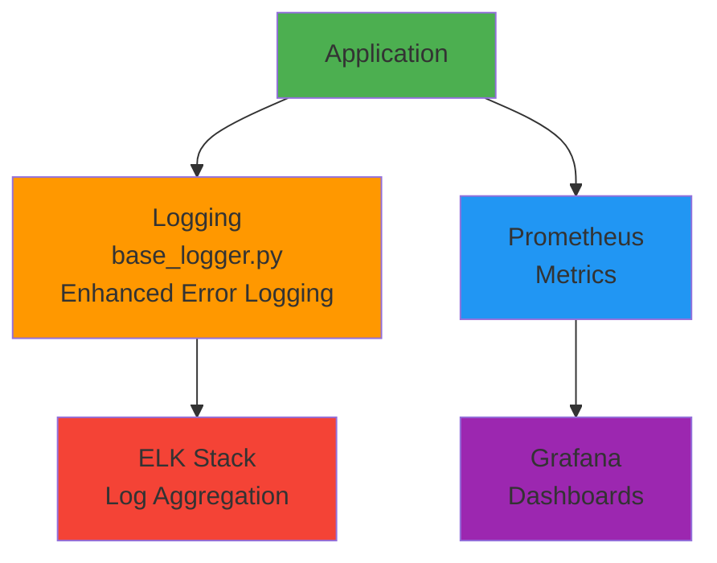

**Current State:**
- Enhanced file-based logging with error context
- Structured error logging with stack traces
- No metrics collection
- No distributed tracing

---

## Conclusion

This architecture provides a solid foundation for an AIOps dashboard with time-series forecasting capabilities. The modular design allows for independent scaling of components and clear separation of concerns.

**Key Strengths:**
- Clear separation between frontend and backend
- Modular forecasting engine
- Containerized deployment
- Well-structured database schema
- Comprehensive error handling
- Input validation and type safety
- Test coverage with unit and integration tests
- Database integration in UI with fallback mechanism

**Areas for Improvement:**
- Add caching layer (Redis)
- Implement full authentication
- Add comprehensive monitoring
- Optimize for async operations
- Add API versioning
- Implement rate limiting

---

*Last Updated: 2025-01-27*  
*Version: 2.0*
