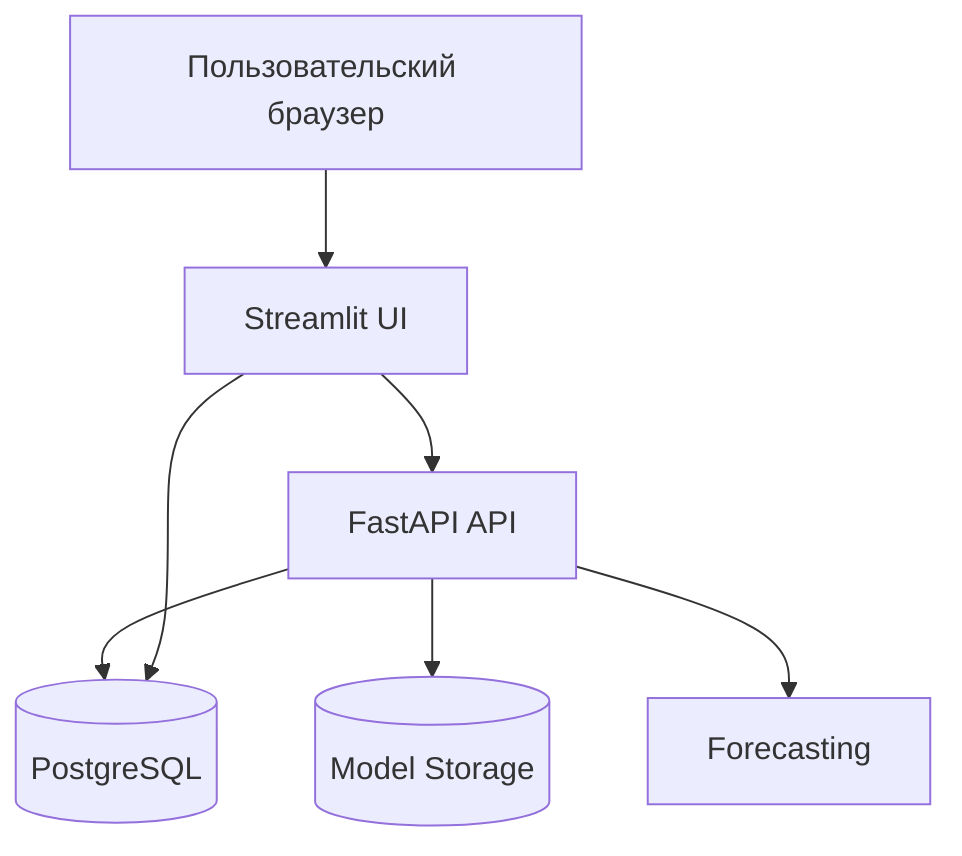
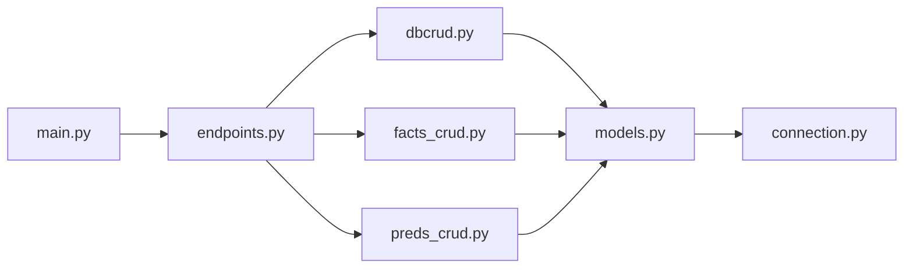
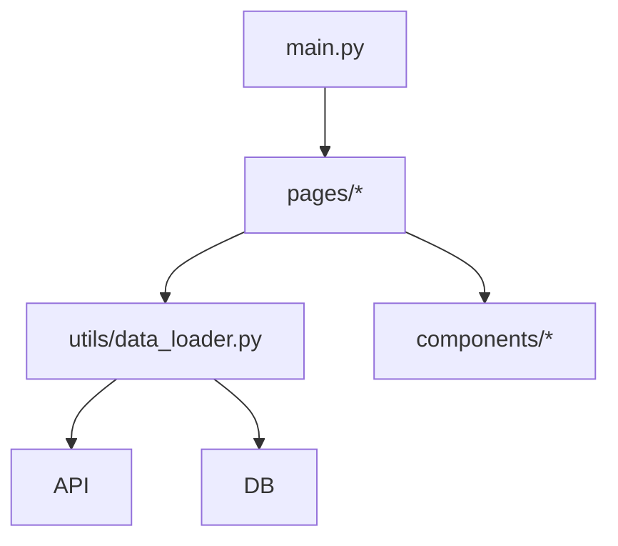
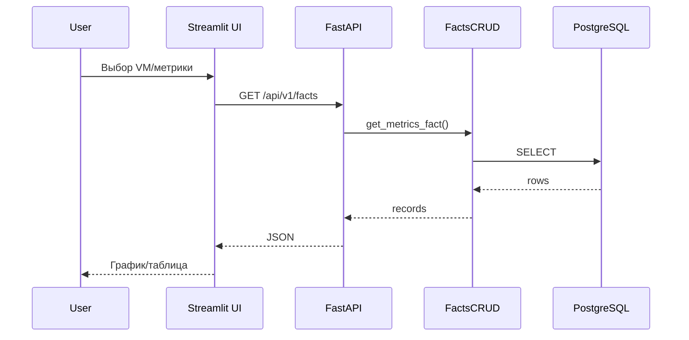
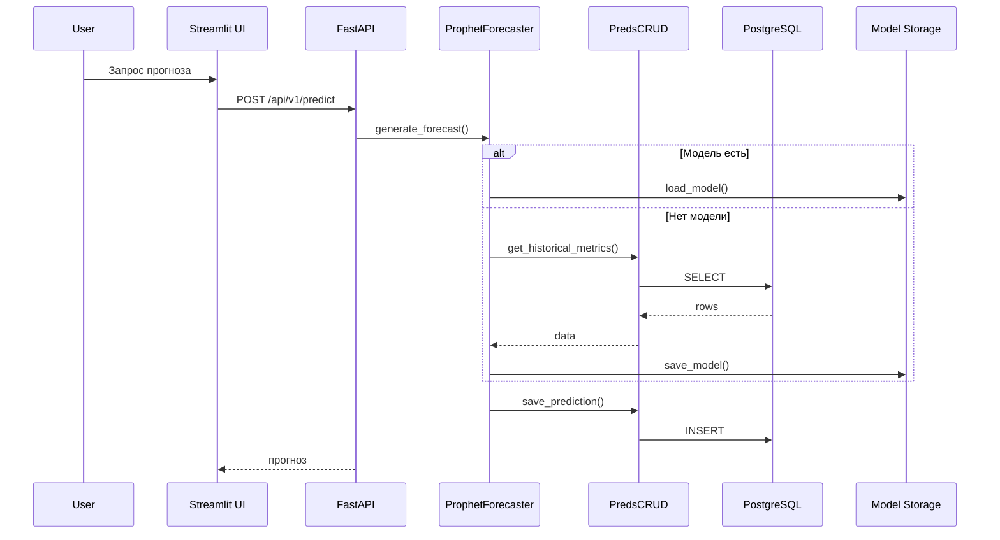
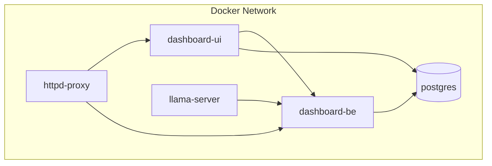
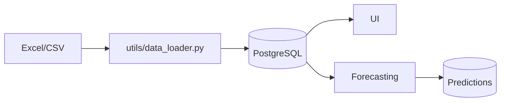

# Архитектура проекта и диаграммы

Документ описывает архитектуру AIOps Dashboard и содержит диаграммы для быстрого понимания компонентов, потоков данных и развертывания.

## Обзор системы

Проект состоит из:
- **Backend API**: FastAPI (`src/app`)
- **UI**: Streamlit (`src/ui`)
- **Forecasting**: Prophet и вспомогательные модули (`forecast`)
- **БД**: PostgreSQL
- **Инфраструктура**: Docker Compose, опционально HTTPd и Keycloak

## Высокоуровневая архитектура

## Архитектура backend (FastAPI)

## Архитектура UI (Streamlit)

## Поток данных (фактические метрики)

## Поток прогнозирования

## Развертывание (Docker Compose)

## Хранилища и данные

## Примечания
- Диаграммы отражают текущую структуру репозитория, без учета внешних интеграций, не включенных в запуск.
- Детальное описание и расширенные диаграммы есть в `docs/ARCHITECTURE.md`.
